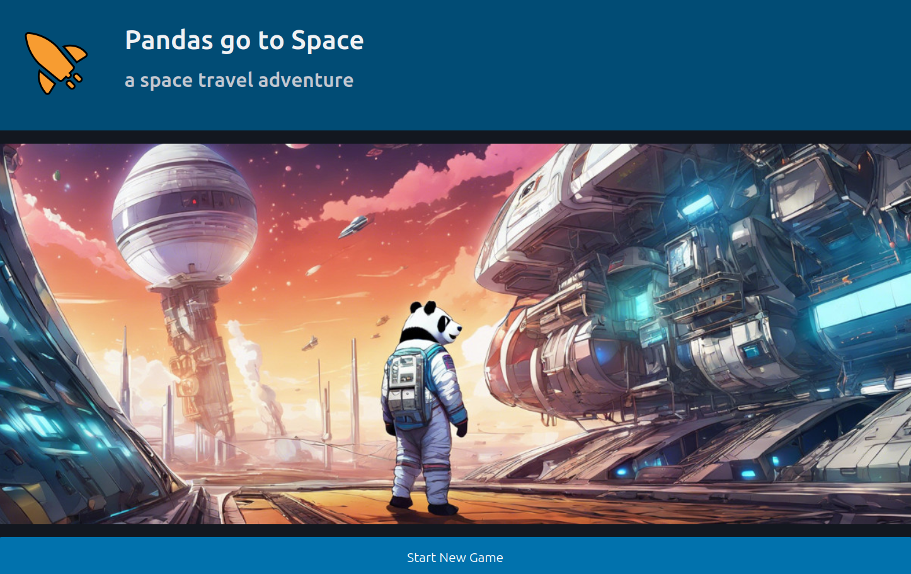

Goals
=====

In this tutorial, you will refactor the code of the adventure game **"Pandas go to Space"**.
In particular, you will implement the **Repository Pattern** that builds a persistence layer.

Learnings you can expect:

- apply the Dependency Inversion Principle
- create a repository module
- separate domain model from persistence logic
- separate test and production databases
- manage test data
- compare implementations with DuckDB, MongoDB and PostgreSQL
- switch between databases flexibly
- separate unit and integration tests

All of this can be achieved with standard Python code and a few libraries. The purpose is to create a clean and maintainable architecture, not to strive for optimized code.
