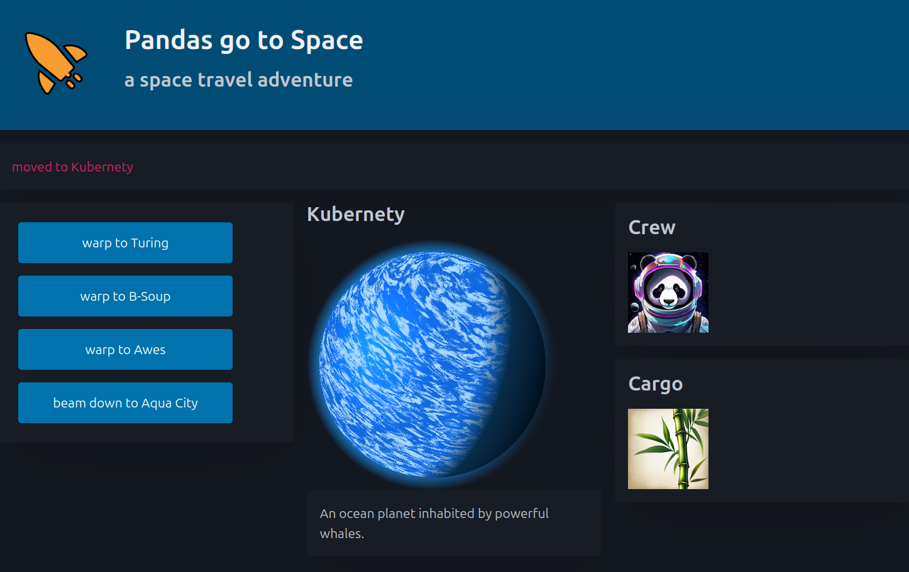

Preparations
============

Get the code
------------

Download the code by cloning the repository `github.com/repo_tutorial <https://github.com/repo_tutorial>`__ .
You will need the folder ``space_project/`` . It should contain the following files:

.. code::

    TODO: tree

Install Libraries
-----------------

We will use ``uv`` to manage the environment. The following should create the environment: 

.. code::

    python -m pip install uv
    uv sync

Then, run the tests:

.. code::

    uv run pytest

Run the game
------------

Start the ``arcade``-based GUI:

.. code::

    uv run space_game

Alternatively, try the console interface:

.. code::

    uv run space_game/cli.py

Complete the web interface
--------------------------

There is an incomplete FastAPI-based web interface. Start the server with:

.. code::

    uv run fastapi run --reload space_game/app.py

visit the game on http://localhost:8000 .
If you like, inspect the endpoints at http://localhost:8000/docs .

The code in ``app.py`` is incomplete. You will need to connect it to ``facade.py`` .
Complete the FastAPI functions so that the game runs in a browser as well.

Play the game
-------------

Take yourself a moment to travel the universe. There are six characters, including the panda. 
How many can you find?
